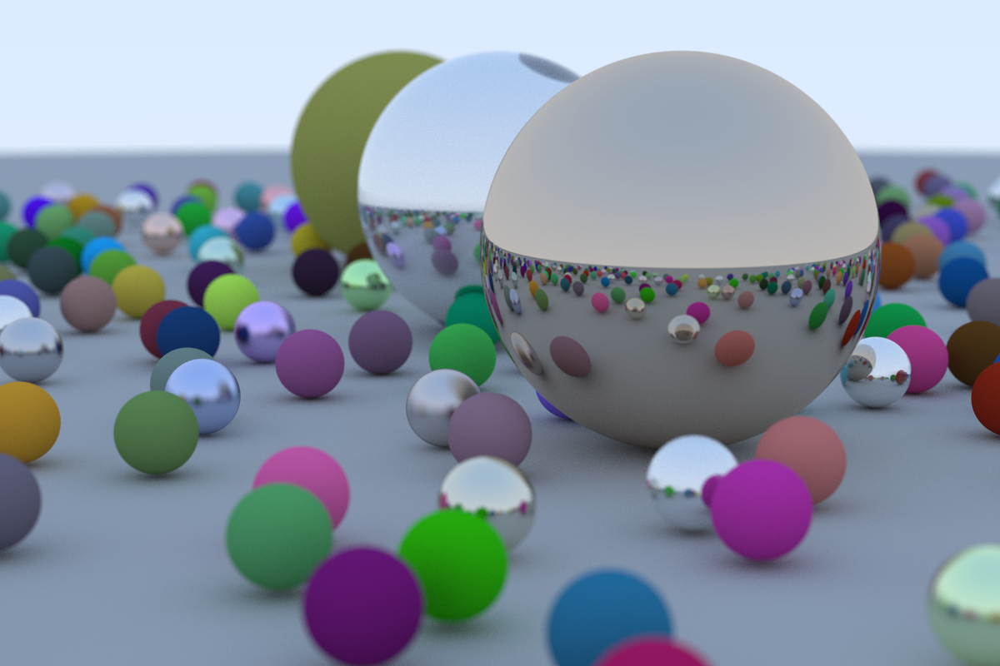

# Rayrust

Implementation of [_Ray Tracing in One Weekend_](https://raytracing.github.io/books/RayTracingInOneWeekend.html) using
Rust



### Usage

Clone the repository:

```
git clone git@github.com:liskajiri/rayrust.git
```

Compile and run using:

```
cargo run --release
```

### Dependencies

- [rand](https://docs.rs/rand/latest/rand/) = Random number generator
- [image](https://docs.rs/image/latest/image/) = Saving images as png
- [rayon](https://docs.rs/rayon/latest/rayon/) = Parallelism
